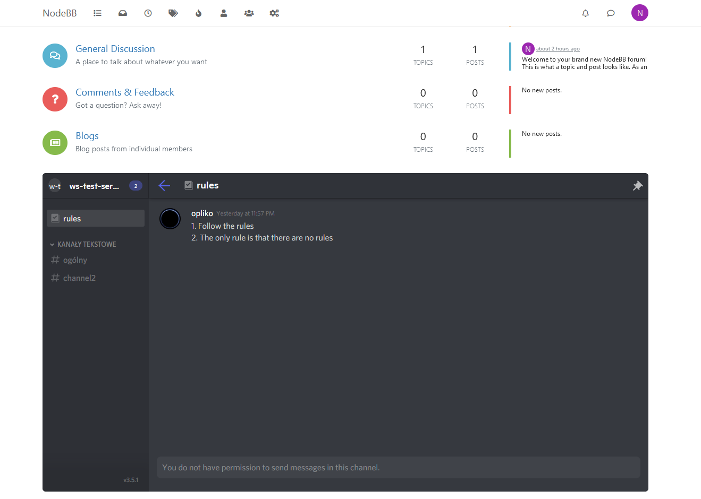

# Discord Embed Widget for NodeBB

A simple widget for embedding Discord chat using [Widgetbot](https://widgetbot.io/).

## Installation

    npm install nodebb-widget-discord-embed

## Usage

1. Add Widgetbot to your server (https://add.widgetbot.io/)
2. Configure Widgetbot using `/setup` command and following the instructions
3. Enable developer mode in your discord client (under advanced settings)
4. On your forum, go to `admin/extend/widgets`
5. Select "Discord Chat" widget from the dropdown on the right and drag it to the zone you want the embed to be in
6. Copy the Discord server ID by right clicking the server name and selecting "Copy ID" in the dropdown menu
7. Paste this ID into Server ID field of the widget settings and save
6. You now have a basic widget! You can add a default channel (copy the ID for the channel in a similar manner to the server), enable/disable guest autologin, or modify the widget height and container styling.

### screenshot

